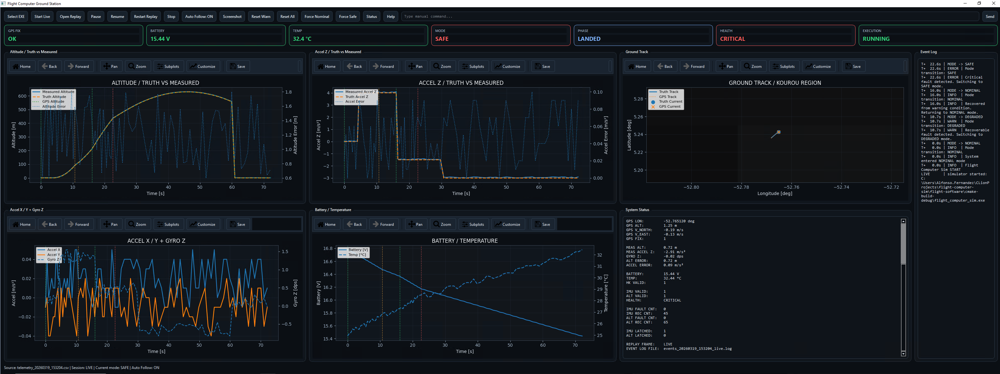

# Flight Computer Simulation  
**Embedded Systems Project with Aerospace Focus**

## Overview

This project is a modular flight computer simulation written in **C**, with a **Python/Qt ground station** for visualization and operator interaction.

It is designed as a learning and portfolio project to explore software patterns commonly found in **embedded** and **aerospace** systems:

- sensor acquisition and simulation
- health monitoring and fault detection
- mode management (`NOMINAL`, `DEGRADED`, `SAFE`)
- telemetry generation
- command handling
- replay and analysis tools
- unit testing of critical logic

The goal is not to build a full real-world flight stack, but a clean and extensible software architecture inspired by **on-board computer / flight software** design.

---

## Main Components

### Flight Software (C)

The embedded side is organized into small modules with clear responsibilities:

- `bsp/` → platform abstraction (`time`, `uart`)
- `drivers/` → simulated sensors (`IMU`, `altimeter`, `GPS`, housekeeping)
- `simulation/` → vehicle truth model and geographic reference logic
- `services/` → telemetry, logging, health monitoring, fault management
- `app/` → system state machine
- `comms/` → command parsing and console interaction
- `common/` → shared types and configuration

### Ground Station (Python + Qt)

The ground station provides:

- live telemetry visualization
- command sending
- replay from recorded CSV files
- event log display
- multiple plots for vehicle and sensor data
- ground track view with geographic position
- operator controls for pause, stop, replay, and screenshots

---

## Features

### System Architecture

* Clear separation of concerns:

    * bsp/ → platform abstraction (time, UART)
    * drivers/ → sensor simulation
    * services/ → logic (health, telemetry, logging, faults)
    * app/ → state machine
    * comms/ → command interface
    * common/ → shared types and configuration

### Sensor Simulation

* Simulated IMU
* Simulated altimeter
* Configurable failure windows

### Health Monitoring

* Continuous system health evaluation
* Supports:

    * Fault counters
    * Recovery counters
    * Latched faults
    * Hysteresis behavior

### Health states:

* HEALTH_OK
* HEALTH_WARNING
* HEALTH_CRITICAL

### Fault Management

* Centralized decision logic
* Mode transitions based on health:

    * NOMINAL
    * DEGRADED
    * SAFE
* Manual override capabilities

### State Machine

#### Modes:

* INIT       → Initial state
* NOMINAL    → Normal operation
* DEGRADED   → Reduced performance (recoverable)
* SAFE       → Critical condition (latched)

### Telemetry

* Periodic telemetry output via UART (stdout)
* Includes:

    * Time
    * System mode
    * Sensor data
    * Health monitor internals (counters, latches)

### Logging

* Timestamped logs
* Levels:

    * INFO
    * WARN
    * ERROR

#### Example:
[INFO][T+1500 ms] System entered NOMINAL mode
[ERROR][T+22000 ms] Critical fault detected. Switching to SAFE mode.

### Command Interface (Console)

Available commands:

* status
* reset_warnings
* reset_all
* force_nominal
* force_safe
* help
* quit

Enables:

* Manual fault reset
* Mode override
* System inspection

---

## Unit Testing

Custom lightweight test framework using C + CMake.

Tested modules:

* State machine
* Health monitor
* Fault manager
* Command parser

Run tests:
ctest --output-on-failure

---

## Build Instructions

Requirements:

* CMake ≥ 3.16
* GCC / MinGW (Windows) or GCC/Clang (Linux/macOS)

Build:
mkdir build
cd build
cmake ..
cmake --build .

Run:
./flight_computer_sim

Design Principles

* Deterministic behavior
* Clear module boundaries
* Separation of IO vs logic
* Fault-tolerant design
* Testability
* Minimal dependencies

Example Behavior

* Altimeter failure → system enters DEGRADED
* Sensor recovery → system returns to NOMINAL
* IMU failure → system enters SAFE (latched)
* Manual reset required to recover from critical fault

Future Improvements

* More realistic sensor models (noise, bias, drift)
* Vehicle dynamics simulation (truth model)
* Ground station (Python) with live telemetry visualization
* TCP/UART communication layer
* Event-driven scheduler
* Advanced fault classification
* Hardware abstraction for real embedded targets

Purpose

* Learning platform for embedded systems
* Portfolio project for aerospace / embedded roles
* Foundation for more advanced flight software simulations

License

MIT (or your preferred license)

## Features

### System Architecture

* Clear separation of concerns:

    * bsp/ → platform abstraction (time, UART)
    * drivers/ → sensor simulation
    * services/ → logic (health, telemetry, logging, faults)
    * app/ → state machine
    * comms/ → command interface
    * common/ → shared types and configuration

### Sensor Simulation

* Simulated IMU
* Simulated altimeter
* Configurable failure windows

### Health Monitoring

* Continuous system health evaluation
* Supports:

    * Fault counters
    * Recovery counters
    * Latched faults
    * Hysteresis behavior

### Health states:

* HEALTH_OK
* HEALTH_WARNING
* HEALTH_CRITICAL

### Fault Management

* Centralized decision logic
* Mode transitions based on health:

    * NOMINAL
    * DEGRADED
    * SAFE
* Manual override capabilities

### State Machine

#### Modes:

* INIT       → Initial state
* NOMINAL    → Normal operation
* DEGRADED   → Reduced performance (recoverable)
* SAFE       → Critical condition (latched)

### Telemetry

* Periodic telemetry output via UART (stdout)
* Includes:

    * Time
    * System mode
    * Sensor data
    * Health monitor internals (counters, latches)

### Logging

* Timestamped logs
* Levels:

    * INFO
    * WARN
    * ERROR

#### Example:
[INFO][T+1500 ms] System entered NOMINAL mode
[ERROR][T+22000 ms] Critical fault detected. Switching to SAFE mode.

### Command Interface (Console)

Available commands:

* status
* reset_warnings
* reset_all
* force_nominal
* force_safe
* help
* quit

Enables:

* Manual fault reset
* Mode override
* System inspection

---

## Unit Testing

Custom lightweight test framework using C + CMake.

Tested modules:

* State machine
* Health monitor
* Fault manager
* Command parser

Run tests:
ctest --output-on-failure

---

## Build Instructions

Requirements:

* CMake ≥ 3.16
* GCC / MinGW (Windows) or GCC/Clang (Linux/macOS)

Build:
mkdir build
cd build
cmake ..
cmake --build .

Run:
./flight_computer_sim

Design Principles

* Deterministic behavior
* Clear module boundaries
* Separation of IO vs logic
* Fault-tolerant design
* Testability
* Minimal dependencies

Example Behavior

* Altimeter failure → system enters DEGRADED
* Sensor recovery → system returns to NOMINAL
* IMU failure → system enters SAFE (latched)
* Manual reset required to recover from critical fault

Future Improvements

* More realistic sensor models (noise, bias, drift)
* Vehicle dynamics simulation (truth model)
* Ground station (Python) with live telemetry visualization
* TCP/UART communication layer
* Event-driven scheduler
* Advanced fault classification
* Hardware abstraction for real embedded targets

Purpose

* Learning platform for embedded systems
* Portfolio project for aerospace / embedded roles
* Foundation for more advanced flight software simulations

License

MIT (or your preferred license)
